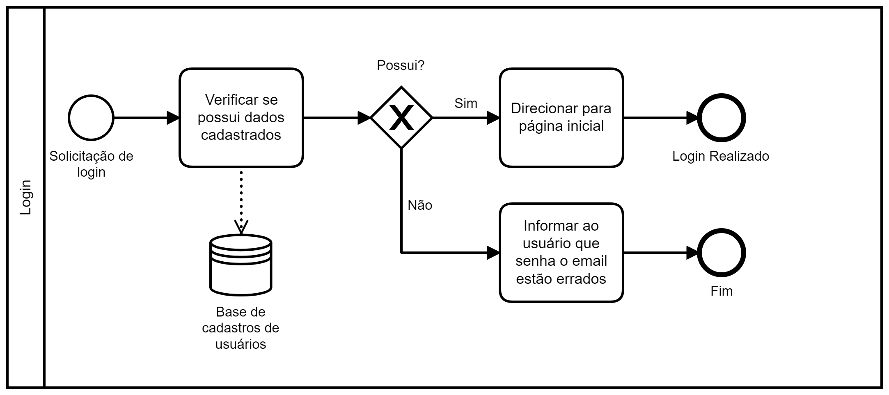
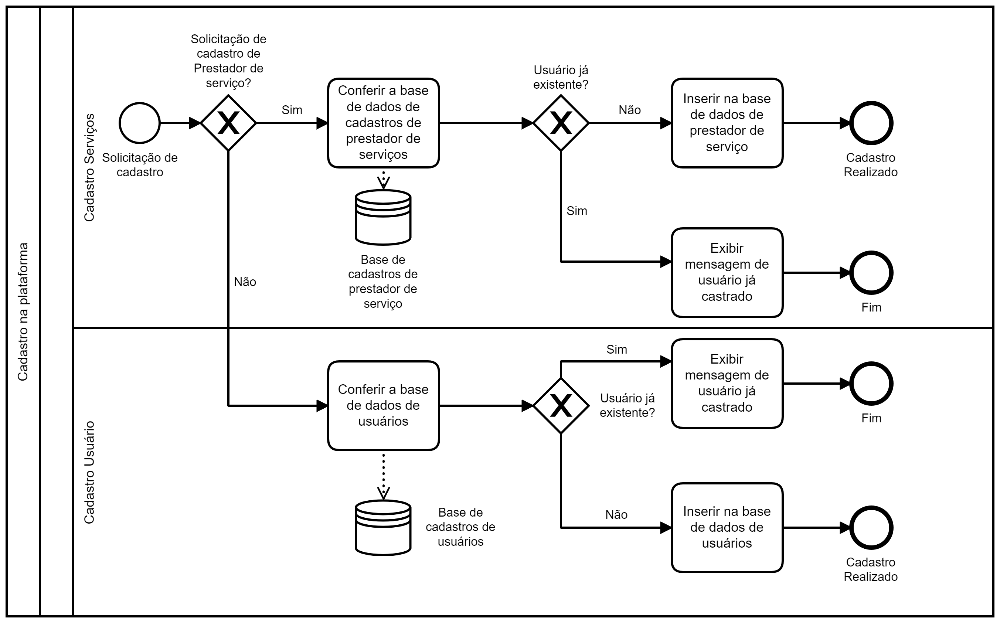
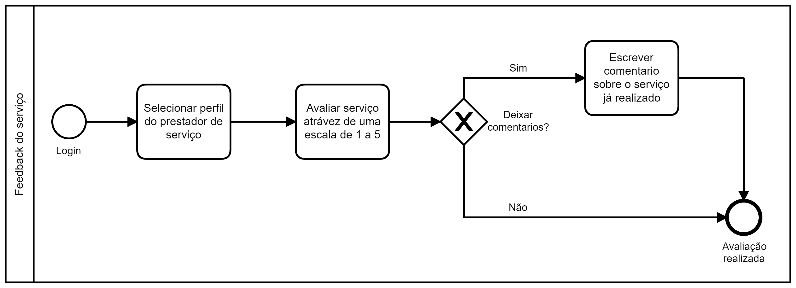

# Especificações do Projeto

Pré-requisitos: <a href="1-Documentação de Contexto.md"> Documentação de Contexto</a>

Definição do problema e ideia de solução a partir da perspectiva do usuário. É composta pela definição do  diagrama de personas, histórias de usuários, requisitos funcionais e não funcionais além das restrições do projeto.

Apresente uma visão geral do que será abordado nesta parte do documento, enumerando as técnicas e/ou ferramentas utilizadas para realizar a especificações do projeto

## Personas

Segundo Spandin e Quincoses (2015, p.02) o estudo da persona da marca como objeto de investigação aconteceu pela motivação de entender como o perfil das marcas teve que se adaptar às novas exigências dos consumidores. Percebe-se que as marcas utilizam das personas para se tornarem humanas e tentar um contato mais direto com os públicos. Com a criação da persona da marca, ela passa a ser representada e percebida pelos públicos de forma mais espontânea e informal. (Quincoses e Spandin 2015), entender as personas de um projeto acaba por criar uma ligação da parte formal do projeto com a parte pessoal do mesmo, dando a ele uma identidade sobre a qual o trabalho indagado irá criar uma personalidade. Após a criação de nosso público alvo as personas como sendo: 
<ol>
 
 *	Ricardo Souza, 53 anos, empresário, consultor empresarial, recém divorciado, pai de três filhos, morador de Belo Horizonte- MG, atualmente trabalha 15hs por dia, no período da pandemia, em sua nova vida de solteiro necessita de um profissional para reforma de seu “novo” apartamento, situado em uma área mais antiga da cidade. 
  * Beatriz Menezes, 40 anos, professora universitária, casada, dois filhos, moradora de Nova Lima - Mg, trabalhava 12 horas por dia, com filhos e sua profissão e de seu marido, serviços básicos de manutenção de casa ficam em segundo plano, necessita de profissional de confiança, para que possa trabalhar enquanto o serviço seja realizado em sua casa. 
 * Ângela Miranda, 25 anos, estudante de designer de ambiente, graduada em arquitetura, apesar da faculdade e dos cursos já realizados, não possui um portfolio muito expeço tendo como clientes apenas amigos e parentes, tem a necessidade de ampliar a gama de clientes e demonstrar seu. 
* Marco Nascimento, pedreiro, 35 anos, casado, pai de um filho, mora de aluguel, residente em Belo Horizonte. Necessita de uma forma de apresentar seus serviços a seus clientes, que muitas das vezes não tem tempo para uma reunião mais prolongada. 
* Francisco Dias, faz tudo, 49 anos, casado, sem filhos, apesar de ser um profissional antigo no mercado e com diversos clientes, não possui uma forma de divulgação de seu trabalho muito eficiente, a não ser o “Boca a Boca”, precisa de uma forma de divulgação de seus serviços mais eficaz.
* Luiz Souza, Vendedor, 35 anos, solteiro, Sindico de prédio, o sr Luiz necessita de diversos profissionais de áreas distintas, porem não encontra profissionais qualificados ou de confiança para a realização dos serviços, acaba ficando a merecer de profissionais picaretas e mal preparados. 

## Histórias de Usuários

Com base na análise das personas forma identificadas as seguintes histórias de usuários:
<ol>
 
TABELA 01- Historia de Usuario
|EU COMO... `PERSONA`| QUERO/PRECISO ... `FUNCIONALIDADE`                               |                           PARA ... `MOTIVO/VALOR`                 |
|--------------------|------------------------------------------------------------------|-------------------------------------------------------------------|
|Ricardo Souza       |Profissionais de reforma em geral                                 | [CU-001]- Acesso às informações publicas dos colaboradores|
|Beatriz Menezes     |Profissional com boas recomendaçoe e de confiança                 | [CU-002]- Acesso a relatorios e avaliações pertinentes dos colaboradores|
|Angela Miranda      |Divulgação de seu trabalho                                        | [CU-003]- criar galeria de fotos para a apresentação e divulgação dos serviços|
|Marco Nascimento    |Apresentar os trabalho realizados de forma simple e eficiente     | [CU-004]- Criar um portifolio para melhor divulgar seu trabalho|
|Francisco Dias      |Elabora uma melhor divulgação de seus serviços para novos clientes| [CU-005]- Criar relatorios de avaliação de serviços realizados|
|Luiz Souza          |Bons profissionais de confiança                                   | [CU-002]- Acesso a relatorios e avaliações pertinentes dos colaboradores|

Fonte: Elaborado pelos autores (2022).
</ol>

## Modelagem do Processo de Negócio 

### Análise da Situação Atual

Apresente aqui os problemas existentes que viabilizam sua proposta. Apresente o modelo do sistema como ele funciona hoje. Caso sua proposta seja inovadora e não existam processos claramente definidos, apresente como as tarefas que o seu sistema pretende implementar são executadas atualmente, mesmo que não se utilize tecnologia computacional. 

### Descrição Geral da Proposta

Apresente aqui uma descrição da sua proposta abordando seus limites e suas ligações com as estratégias e objetivos do negócio. Apresente aqui as oportunidades de melhorias.

### Processo 1 – Login

Representação do processo de login dos usuários.

### Processo 2 – Cadastro

Representação do processo de cadastro de serviços e  dos usuários.

 
 ### Processo 3 – Feedback

Representação do processo de feedback de serviços realizados.

## Indicadores de Desempenho

Principais indicadores de desempenho e algumas metas para o processo. Atenção: as informações necessárias para gerar os indicadores devem estar contempladas no diagrama de classe. Colocar no mínimo 5 indicadores. 

|Indicador|	Objetivos|	Descrição| Cálculo|	Fonte dados | Perspectiva|
|---------|------------------------------------------------|--------------------------------------------------------------------|--------|--------|--------|
|Cadastros de usuários|	Avaliar popularidade e aceitação do aplicativo |	 Medir a aceitação do aplicativo atráves da quantidade de cadastros de novos usuários  | Percentual de novos usuários  | Tabela de cadastro deusuários  | Clientes  |
|Cadastros de serviços|	Avaliar aceitação do aplicativo entre os prestadores de serviços |	 Medir a aceitação do aplicativo atráves da quantidade de cadastros de novos prestadores de serviços  | Percentual de novos prestadores de serviço  | Tabela de cadastro de prestadores de serviços  | Clientes  |
|Percentual de Reclamações|	Avaliar quantidades de avaliações negativas da aplicação|	 Calcular a quantidade de avaliações negativas para o aplicativo por usuários  | Percentual de feedbacks negativos pelo total  | Dados da play store  | Processos Internos  |
|Contagem de cadastro por data|	Avaliar quantidades de serviços e usuários cadastrados por data |	 Medir as datas com maiores adesões ao aplicativo | Contagem por data de cadastros de usuários e serviços | Tabela de cadastros  | Processos Internos  |
|Contratação de serviços|	Avaliar quantidades de serviços contratados |	 Medir a eficiência do aplicativo em divulgar os serviços  | Percentual de serviços contratados  | Tabela de feedback  | Processos Internos  |

Obs.: todas as informações para gerar os indicadores devem estar no diagrama de classe a ser apresentado a posteriori. 

## Requisitos

As tabelas que se seguem apresentam os requisitos funcionais e não funcionais que detalham o escopo do projeto. Para determinar a prioridade de requisitos, aplicar uma técnica de priorização de requisitos e detalhar como a técnica foi aplicada.

### Requisitos Funcionais

<ol>

 TABELA 02- Requistos funcionais 
|ID|	Descrição do Requisito|	Prioridade|
|------|--------------------------|--------|
|      | Agente Fornecedor        |        |
|RF-001|	Cadastrar conta          |	 ALTA  |
|RF-002|	Login de conta           |	 ALTA  |
|RF-003|	Alterar conta            |  ALTA  |
|RF-004|	Excluir conta            | 	ALTA  |
|RF-005|	Visualizar os seus dados | 	MÉDIA |
|RF-006|	Visualizar feedback      | 	ALTA  |
|RF-007|	Alterar dados            |	 ALTA  |
|RF-008|	Excluir dados            | 	MÉDIA |
|RF-009|	Cadastro de serviço      |  MÉDIA |
|RF-010|	Cadastrar dados	         |  ALTA  |
|      |                          |        |	
|      |	Agente Empregador	       |        |
|RF-001|	Cadastrar conta	         |  ALTA  |
|RF-002|	Login de conta           |	 ALTA  |
|RF-003|	Alterar conta	           |  ALTA  |
|RF-004|	Excluir conta	           |  ALTA  |
|RF-005|	Visualizar profissionais	| MÈDIA  |
|RF-006| Realizar FeedBack        |  Alta  | 
|RF-006| Visualizar FeedBack      |  Alta  | 

 Fonte: Elaborado pelos autores (2022).
</ol>

### Requisitos não Funcionais

<ol>

 TABELA 03- Requisitos não funcionais
 
|ID	Descrição do Requisito	|Prioridade|
|--------------------------|----------|
|RNF-001|	O sistema será construído através da arquitetura MVC| MÉDIA|
|RNF-002|	O sistema deve ser capaz de apresentar uma boa usabilidade para Usuario| BAIXA|
|RNF-003|	O sistema deve ser capaz de tratar exceções e se recuperar de falhas sem que haja perda de dados| BAIXA|
|RNF-004|	O sistema vai utilizar "??" | ALTA|
|RNF-005|	Será utilizada a ferramenta PhpmyAdmin para desenvolvimento e administração de base de dados|	ALTA|
|RNF-006|	O sistema não pode demorar para processar|	ALTA|

 Fonte: Elaborado pelos autores (2022).
 </ol>

## Restrições

<ol>
 
O projeto está restrito pelos itens apresentados na tabela a seguir.

Tabela 4 – Restrições 

|ID|	                      Restrição                          |
|--|----------------------------------------------------------|
|01|	O projeto deverá ser entregue até o final do semestre    |
|02|	Não funciona sem rede de internet                        |
|03|	Focado para Fornecedores e Empregadores de qualquer setor|
|04|	Interação com o Fornecedor                               |
|05|	Interação com o Empregador                               |
|06|	Deverá ser gerenciável                                   |
|07|	Deverá apresentar atualizações em tempo real             |
 
Fonte: Elaborado pelos autores (2022).

</ol>
 
## Diagrama de Casos de Uso

<ol>
 

 </ol>

# Matriz de Rastreabilidade

<ol>

|Requisitos X Casos de uso         |CU-001 |CU-002 |CU-003 |CU-004 |CU-005 |       |
|----------------------------------|-------|-------|-------|-------|-------|-------|
|                                                  Agente Fornecedor               |					
|RF-001 - Cadastrar conta          |       |       |       |       |       |     		|				
|RF-002- Realizar login						      |       |       |       |       |       |       |
|RF-003- Alterar conta						       |       |       |       |       |       |       |
|RF-004- Excluir conta						       |       |       |       |       |       |       |
|RF-005- Visualizar os seus dados  |       |       |   X   |   X   |   X   |       |
|RF-006- Visualizar feedback 				  |       |       |       |       |       |       |
|RF-007- Alterar dados						       |       |       |       |   X   |   X   |       |
|RF-008- Excluir dados						       |       |       |       |       |       |       |
|RF-009 Cadastro de serviço						  |       |       |   X   |   X   |   X   |       |
|        					                     |       |       |       |       |       |       |
|						                            |       |       |       |       |       |       |
|						                            |       |       |       |       |       |       |
|	                  				                          Agente Empregador                |
|RF-001- Cadastrar conta						     |       |       |       |       |       |       |
|RF-003- Alterar conta						       |       |       |       |       |       |       |
|RF-004- Excluir conta						       |       |       |       |       |       |       |
|RF-005- Visualizar profissionais		|   X   |       |       |       |       |       |
|RF-006- Realizar feedback		       |       |   X   |       |       |       |       |
|RF-007- Visualizar FeedBack       |  X    |   X   |       |       |       |       |

Fonte: Elaborado pelos autores (2022).

</ol>

# Gerenciamento de Projeto

De acordo com o PMBoK v6 as dez áreas que constituem os pilares para gerenciar projetos, e que caracterizam a multidisciplinaridade envolvida, são: Integração, Escopo, Cronograma (Tempo), Custos, Qualidade, Recursos, Comunicações, Riscos, Aquisições, Partes Interessadas. Para desenvolver projetos um profissional deve se preocupar em gerenciar todas essas dez áreas. Elas se complementam e se relacionam, de tal forma que não se deve apenas examinar uma área de forma estanque. É preciso considerar, por exemplo, que as áreas de Escopo, Cronograma e Custos estão muito relacionadas. Assim, se eu amplio o escopo de um projeto eu posso afetar seu cronograma e seus custos.

## Gerenciamento de Tempo

Com diagramas bem organizados que permitem gerenciar o tempo nos projetos, o gerente de projetos agenda e coordena tarefas dentro de um projeto para estimar o tempo necessário de conclusão.

O gráfico de Gantt ou diagrama de Gantt também é uma ferramenta visual utilizada para controlar e gerenciar o cronograma de atividades de um projeto. Com ele, é possível listar tudo que precisa ser feito para colocar o projeto em prática, dividir em atividades e estimar o tempo necessário para executá-las.

## Gerenciamento de Equipe

O gerenciamento adequado de tarefas contribuirá para que o projeto alcance altos níveis de produtividade. Por isso, é fundamental que ocorra a gestão de tarefas e de pessoas, de modo que os times envolvidos no projeto possam ser facilmente gerenciados. 

## Gestão de Orçamento

O processo de determinar o orçamento do projeto é uma tarefa que depende, além dos produtos (saídas) dos processos anteriores do gerenciamento de custos, também de produtos oferecidos por outros processos de gerenciamento, como o escopo e o tempo.

